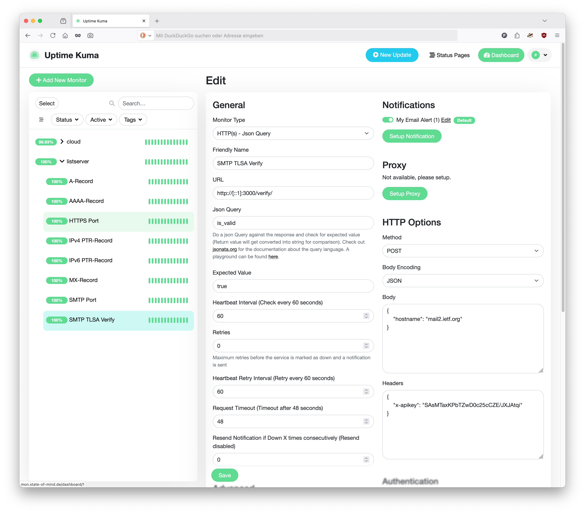

= SMTP DANE Verify
:experimental:
:toc:

SMTP DANE verify is a service that let's you monitor and detect typical DANE
related problems for DANE-enabled inbound SMTP services.

Integrated in a monitoring service SMTP DANE Verify will either walk a given
domain and verify all MX hosts referred to are DANE compliant or it will verify
a single host is DANE compliant.

The service will do this add hoc when requested to do so using JSON via it's
REST API in a JSON formatted HTTP response and / or it will verify domains
periodically when configured appropriately at startup and it will publish the
verification results in an openmetrics compliant request / response call.

== What exactly will SMTP-DANE-Verify test?

*Given a domain* to test SMTP-DANE-Verify will:

. verify the given DNS zone is DNSSEC-enabled and that all responses can be
  DNSSEC-verified correctly
. walk a list of all MX records published in the requested domain
.. verify there is at least one TLSA record associated with the MX resource
.. verify at least one TLSA resource record matches with the MX services'
   x509 certificate fingerprint

If one or more MX records refer to a mail service located outside of the given
(policy) domain SMTP-DANE-Verify will also:

. verify the mail service's DNS zone is DNSSEC-enabled and that all responses
  can be DNSSEC-verified correctly
.. verify there is at least one TLSA record associated with the MX resource
   referred to
.. verify at least one TLSA resource record matches with the MX services'
   x509 certificate fingerprint

*Given a host* to test SMTP-DANE-Verify will:

. verify the given DNS zone is DNSSEC-enabled and that all responses can be
  DNSSEC-verified correctly
.. verify there is at least one TLSA record associated with the host
.. verify at least one TLSA resource record matches with the hosts'
   x509 certificate fingerprint

In any case SMTP-DANE-Verify aims to provide an overview what *exactly* is
wrong. Therefore it will not stop it's testing if e.g. DNSSEC-verification
fails, but all the TLSA record MX service tests succeed. We consider this useful
e.g. if a platform is on the way to become fully DANE compliant, but for
whatever reason not there yet.

== How do I use SMTP-DANE-Verify?

Either you integrate the projects Python library
https://pypi.org/project/smtp-dane-verify/[smtp-dane-verify^] into your own
service environment or you pull and run the docker container
https://hub.docker.com/repository/docker/sys4ag/smtp-dane-verify/general[SMTP-DANE-Verify^],
request test runs on your monitoring platform from the service running inside
the container and handle the test results in your monitoring. The following
sections walk you through the docker setup and configuration steps.

== Running smtp-dane-verify as docker container

Running the SMTP-DANE-Verify container was designed to be straight forward. The
docker container consists of a Debian based container image which runs the
smtp-dane-verify service. Unless the environment, the docker container runs in,
provides DNSSEC-verifying DNS resolvers it is recommended and default to also
run a second container which will run the unbound DNS resolver as helper service
for SMTP-DANE-Verify.

In order to avoid abuse smtp-dane-verify requires clients to authenticate
themselves. The authentication procedure requires the client to send an API key.
This API key must be generated beforehand and provided to smtp-dane-verify
during startup.

Within the container smtp-dane-verify binds to port `3000/tcp`. Any
configuration that aims to make smtp-dane-verify's service available to the
outside must map one of the container's outside ports to port `3000/tcp` on the
inside.

In case smtp-dane-verify should also gather and provide SMTP DANE verification
results for applications using the https://openmetrics.io/[openmetrics^]
standard a list of one or more domains must be configured and provided to
smtp-dane-verify at startup.

[NOTE]
.Why preconfigure domains for openmetrics?
====
Running the tests takes time. During development our tests showed test durations
may easily exceed the time clients, using the openmetrics standard, are
configured to wait for a response. This caused annoying and misleading errors.

To avoid these errors we decided to let smtp-dane-verify periodically check for
a list of one or more domains and have the results ready when they are requested
via openmetrics.

The tradeoff with this approach is the list of domains to verify needs to be
maintained and the container needs to be restarted afterwards but we consider
this a minor tradeoff as we do expect this list to change rarely.
====

== Installing and configuring the SMTP-DANE-Verify docker container

This section assumes you already have a working docker environment in place and
are comfortable configuring and running docker containers.

.Configuration Steps
. Create a directory to hold the `docker-compose.yml` file
. Create an API key
. Configure SMTP-DANE-Verify
. Start the container
. Test the service on command-line
. Integrate the service in your monitoring

=== Creating the SMTP-DANE-Verify directory

Create a directory, e.g. `/opt/docker/smtp-dane-verify`, where you will place
the `docker-compose.yml` file.

=== Creating an API key

There are several ways to come up with an API key. A simple way to compute a
random key is to use the following command pipe:

[source,console]
----
% base64 /dev/urandom | head -c30
SAsMTaxKPbTZwD0c25cCZEJXJAtqif
----

Save the output and use it in the following step as `APIKEY` environment
variable in smtp-dane-verify's `docker-compose.yml` configuration file.

=== Configuring SMTP-DANE-Verify

Like any other docker container SMTP-DANE-Verify is configured best using a
`docker-compose.yml` file which specifies the container(s) to run and provides
environment variables that will be passed on to the service running inside and
configuring its runtime behaviour.

The recommended way to configure and run SMTP-DANE-Verify in
`docker-compose.yml` is to specify to pull and run `sys4ag/smtp-dane-verify`
(SMTP-DANE-Verify) *and* `mvance/unbound` (DNSSEC-validating DNS Resolver) from
docker hub and configure `smtp-dane-verify` to use `unbound` as `NAMESERVER`.

Assign the API key (here: SAsMTaxKPbTZwD0c25cCZEJXJAtqif) you computed to
`APIKEY` and - optionally - if you want to gather results using openmetrics
provide a comma-separated list of one or more domains `smtp-dane-verify` should
periodically test using the `METRICS_DOMAINS` parameter. The default intervall
at which it tests, is `60` seconds. Use `METRICS_INTERVAL` to set a different
intervall if you need to.

[source,yaml]
.docker-compose.yml
----
name: smtp-dane-verify
services:
  smtp-dane-verify:
    image: sys4ag/smtp-dane-verify
    container_name: smtp-dane-verify
    environment:
      APIKEY: SAsMTaxKPbTZwD0c25cCZEJXJAtqif
      NAMESERVER: unbound
      METRICS_DOMAINS: example.com,example.net
      METRICS_INTERVAL: 60
    ports:
      - "3000:3000"
    restart: always
  unbound:
    image: mvance/unbound:latest
    container_name: unbound
    restart: always
----

=== Starting the container

If not there yet change into the container directory and bring the service up
using the `docker-compose up` sub-command and detach the container:

[source,console]
----
# docker-compose up -d
[+] up 3/3
 ✔ Network smtp-dane-verify_default Created                0.1s
 ✔ Container smtp-dane-verify       Created                0.1s
 ✔ Container unbound                Created                0.1s
----

Then use e.g. the `lsof` command to verify the service listens for client
connections:

[source,console]
----
# lsof -Pni :3000
COMMAND      PID USER FD   TYPE  DEVICE SIZE/OFF NODE NAME
docker-pr 924564 root  7u  IPv4 6367294      0t0  TCP *:3000 (LISTEN)
docker-pr 924572 root  7u  IPv6 6367295      0t0  TCP *:3000 (LISTEN)
----

If the service is available you are ready to test smtp-dane-verify on
command-line.

=== Testing the service on command-line

Use the `curl` command to send a test request to `smtp-dane-verify`. The
following example requests `smtp-dane-verify` to test the domain `ietf.org` - it
uses the API key provided in the `docker-compose.yml`:

[source,console]
----
% curl \
    --header "x-apikey: SAsMTaxKPbTZwD0c25cCZEJXJAtqif" \
    --header "Content-Type: application/json" \
    --request POST \
    --data '{"domain":"ietf.org"}' \
    http://[::1]:3000/verify/
----

Upon return `smtp-dane-verify` will output
https://www.rfc-editor.org/rfc/rfc8259[RFC 8259^] formatted JSON data. This is
read easily by machines but comparably hard to process by humans. Therefore, for
the purpose of better readbility, the test response was piped through the `jq`
command and the output looked like this when we built the documentation:

[source,json]
----
{
  "all_hosts_dane_verified": true,
  "dnssec_valid": true,
  "domain": "ietf.org",
  "mx_hosts": [
    {
      "host_dane_verified": true,
      "dnssec_valid": true,
      "dnssec_status": "secure",
      "protocol_version": "TLSv1.3",
      "hostname": "mail2.ietf.org",
      "ciphersuite": "TLS_AES_256_GCM_SHA384",
      "peer_certificate": "CN = *.ietf.org",
      "hash_used": "SHA256",
      "signature_type": "ECDSA",
      "openssl_verification": "OK",
      "openssl_return_code": 0,
      "log_messages": [
        "CONNECTION ESTABLISHED",
        "DANE TLSA 3 1 1 ...e86b88d9968abdf8656beb54 matched EE certificate at depth 0",
        "Server Temp Key: X25519, 253 bits",
        "250 CHUNKING",
        "DONE"
      ],
      "tlsa_resource_records": [
        "3 1 1 d39b310da9dfcb60d705f94f2aea8234fb5b039653c3f0d47a33bc746d28dcae",
        "3 1 1 62196a379de5acc6c72876a7d1ef9799d3096922e86b88d9968abdf8656beb54"
      ]
    }
  ]
}
----

The request returned `all_hosts_dane_verified":true` and this indicates the
overall result of the test was the tested domain (here: ietf.org) was fully DANE
compliant at the time we ran the test. (Just in case anyone might ask: It has
proven to be fully compliant many other times, too.)

Additionally if you want to use the openmetrics API run the following test. It
assumes you are periodically testing `ietf.org` for DANE compliance:

[source,console]
----
% curl --header "x-apikey: SAsMTaxKPbTZwD0c25cCZEJXJAtqif" http://localhost:3000/metrics
# HELP smtp_dane_verify_version Information about the smtp-dane-verify version
# TYPE smtp_dane_verify_version gauge
smtp_dane_verify_version{version="0.3.0"} 1
# HELP smtp_dane_verify_all_hosts_dane_verified Information if all host of domain are DANE verified
# TYPE smtp_dane_verify_all_hosts_dane_verified gauge
smtp_dane_verify_all_hosts_dane_verified{domain="ietf.org"} 1
# HELP smtp_dane_verify_dnssec_valid Information if all DNS records from domain are DNSSEC verified
# TYPE smtp_dane_verify_dnssec_valid gauge
smtp_dane_verify_dnssec_valid{domain="ietf.org"} 1
# HELP smtp_dane_verify_total_mx Total count of MX-records in domain
# TYPE smtp_dane_verify_total_mx gauge
smtp_dane_verify_total_mx{domain="ietf.org"} 1
# HELP smtp_dane_verify_total_tlsa_openssl_ok Total count of TLSA-records verified by OpenSSL
# TYPE smtp_dane_verify_total_tlsa_openssl_ok gauge
smtp_dane_verify_total_tlsa_openssl_ok{domain="ietf.org"} 2
# HELP smtp_dane_verify_num_tlsa Count of TLSA-Records for MX host
# TYPE smtp_dane_verify_num_tlsa gauge
smtp_dane_verify_num_tlsa{mx="mail2.ietf.org"} 2
# HELP smtp_dane_verify_num_tlsa_dane_ta Count of DANE-TA TLSA-Records for mail host (Usage 2)
# TYPE smtp_dane_verify_num_tlsa_dane_ta gauge
smtp_dane_verify_num_tlsa_dane_ta{mx="mail2.ietf.org"} 0
# HELP smtp_dane_verify_num_tlsa_dane_ee Count of DANE-EE TLSA-Records for mail host (Usage 3)
# TYPE smtp_dane_verify_num_tlsa_dane_ee gauge
smtp_dane_verify_num_tlsa_dane_ee{mx="mail2.ietf.org"} 2
----

If `smtp-tlsa-verify` works like this for you you can start integrating it into
your monitoring service.

[NOTE]
.Verifying a single host
====
In case you want to verify a single host use `hostname` instead of `domain` as
part of the data you send and `verify_host` as path instead of
`verify` in your HTTP URI e.g. `http://[::1]:3000/verify_host/`:

[source,console]
----
% curl \
    --header "x-apikey: SAsMTaxKPbTZwD0c25cCZEJXJAtqif" \
    --header "Content-Type: application/json"  \
    --request POST \
    --data '{"hostname":"list.sys4.de"}' \
    http://[::1]:3000/verify_host/
----

The result differs from what you receive when verifing a domain:

[source,console]
----
{
  "host_dane_verified": true,
  "dnssec_valid": true,
  "dnssec_status": "secure",
  "protocol_version": "TLSv1.3",
  "hostname": "list.sys4.de",
  "ciphersuite": "TLS_AES_256_GCM_SHA384",
  "peer_certificate": "CN = list.sys4.de",
  "hash_used": "SHA384",
  "signature_type": "ECDSA",
  "openssl_verification": "OK",
  "openssl_return_code": 0,
  "log_messages": [
    "CONNECTION ESTABLISHED",
    "DANE TLSA 3 1 1 ...63410e4c13a40ab37cb744cf matched EE certificate at depth 0",
    "Server Temp Key: X25519, 253 bits",
    "250 CHUNKING",
    "DONE"
  ],
  "tlsa_resource_records": [
    "3 1 1 e679f71454654354310785c811bfad1f8c4a2b6863410e4c13a40ab37cb744cf",
    "2 1 1 8bb593a93be1d0e8a822bb887c547890c3e706aad2dab76254f97fb36b82fc26",
    "3 1 1 5a5cdb1f9438a36da11e33b31978c4fed0b8996edd2ea2ce206bf9c026c642ad",
    "3 1 1 ac8c9eb13fcf4f8e9d1ea84b880007cb4ffbf9be30f335b57e5c5a509c5137e4"
  ]
}
----

Search for `"host_dane_verified": true` in the output when you integrate SMTP
DANE Verify in e.g. your monitoring.
====

==  Integrating the service in your monitoring

This section describes how to integrate `smtp-tlsa-verify` in your monitoring
service. There is literally a ton of monitoring services available on the
market. We have picked just a few to provide you with some examples. Uptime Kuma
is what we believe to be a typical home-user monitoring service. Zabbix
definitely is a more sophisticated monitoring system ready to provide you with
monitoring at enterprise level. And finally we give an example for scraping
openmetrics results with Prometheus.

=== Uptime Kuma

The project's repository https://github.com/louislam/uptime-kuma[uptime-kuma^]
describes the project as an "easy-to-use self-hosted monitoring tool".

.Uptime Kuma "Add New Monitor" dialogue

Follow these steps to integrate `smtp-dane-verify` into Uptime Kuma:

. Choose menu:Add New Monitor[] and select menu:HTTP(s) - Json Query[] as
  menu:Monitor Type[] in the
  menu:General[] section of the menu:Add New Monitor[] dialogue.
. Give the Monitor a menu:Friendly Name[] e.g. `SMTP DANE Verify`.
. Enter `http://localhost:3000/verify/` as menu:URL[]. +
[NOTE]
In this example Uptime Kuma runs on the same host that runs the
smtp-dane-verify docker container. If you run smtp-dane-verify on different host
do not forget to set the correct hostname / IP address.
. Enter `all_hosts_dane_verified` into the menu:Json Query[] form field
. Enter `true` in the menu:Expected Value[] form field.
. Then turn to the menu:HTTP Options[] section and add the host you want to
  probe as JSON DATA e.g. like this: `{ "hostname": "sys4.de" }`
. Finally provide the `APIKEY` you set in the `docker-compose.yml`. Write it it
  to the menu:Headers[] form field like this: `{ "x-apikey":
  "SAsMTaxKPbTZwD0c25cCZEJXJAtqif" }`
. btn:[Save] the menu:Add New Monitor[] dialogue

=== Zabbix

Zabbix uses templates to configure monitoring a service. The following example
provides an item you may want to
xref:assets/zabbix_smtp_dane_verify_item.yaml[download], import and add to a
template in order to use it combination with hosts you want to verify. The item
assumes you configure Zabbix to request SMTP DANE Verification from a
smtp-dane-verify service running on a remote host (here: 192.0.2.210)

.Zabbix SMTP DANE Verify item
image::assets/zabbix_smtp_tlsa_verify_item.png[]

Once you have the item in place create an dependend item that preprocesses the
data returned from the SMTP DANE Verify item and checks that
`$.all_hosts_dane_verified` is `true`.

=== Prometheus

This example assumes you have configured the `smtp-dane-verify` service to
periodically test the domain sys4.de for DANE compliance.

[source,yaml]
----
scrape_configs:
- job_name: smtp-dane-verify
  params:
    api_key:
    - SAsMTaxKPbTZwD0c25cCZEJXJAtqif
  static_configs:
  - labels: {}
    targets:
    - localhost:8080
----

== Questions? Bugs? Improvements?

You have questions, want to file a bug or submit e.g. another instruction that
shows how to integrate in $MONITORING? Please feel free to use the projects
https://github.com/sys4/smtp-dane-verify/issues[issue tracker^]. In case you
have general questions regarding DANE our
https://list.sys4.de/postorius/lists/dane-users.list.sys4.de/[dane-users]
mailing list might be the right place.

